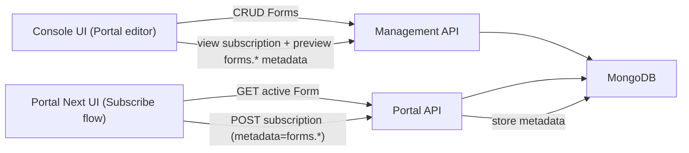

# Forms feature implementation plan

## Scope decisions (confirmed)

- **Form scope**: Environment/Portal-level (one active Form per environment; applies to all subscription checkouts).
- **Answer persistence**: Use existing subscription metadata (string map). Persist answers under a reserved key prefix (e.g. `forms.`) and JSON-stringify non-string values.

## High-level architecture

## Data model (Mongo)

- **Collection**: `forms` (environment-scoped)
- **Document fields** (proposed):
- `id` (string, generated)
- `environmentId` (string)
- `name` (string)
- `description` (string, optional)
- `schema` (string; raw JSON text)
- `active` (boolean)
- `createdAt`, `updatedAt` (timestamps)
- `createdBy`, `updatedBy` (optional, if patterns already exist)
- **Invariant**: at most one `active=true` per `environmentId` (enforced in service logic; optionally via compound index if your Mongo layer supports it).

## Backend — `gravitee-apim-rest-api/`

### 1) Repository + persistence

- Add repository model + Mongo mapping for Forms.
- Likely locations (confirm exact module structure while implementing):
- Repository API: `gravitee-apim-rest-api/gravitee-apim-rest-api-repository/*`
- Mongo impl: `gravitee-apim-rest-api/gravitee-apim-rest-api-repository/*mongodb*`

### 2) Domain/service layer

- Add CRUD + “activate” use-cases/services.
- Validate:
- `schema` must be valid JSON
- schema must conform to the restricted meta-schema described in `Forms-feature.md` (string/number/integer/boolean/enums/oneOf/anyOf/arrays and their constraints).
- enforce single active form per environment (activating one deactivates others).

### 3) REST endpoints (Management API)

- Add management endpoints for Console UI to manage forms.
- Target: **management v2 REST** (Console already uses `management-api-v2` entities).
- Proposed endpoints (final paths should follow existing portal-editor conventions):
- `GET /environments/{envId}/portal-next/forms` (list)
- `POST /environments/{envId}/portal-next/forms` (create)
- `GET /environments/{envId}/portal-next/forms/{formId}` (read)
- `PUT /environments/{envId}/portal-next/forms/{formId}` (update)
- `DELETE /environments/{envId}/portal-next/forms/{formId}` (delete)
- `POST /environments/{envId}/portal-next/forms/{formId}/_activate` (set active)
- Update OpenAPI:
- `gravitee-apim-rest-api/gravitee-apim-rest-api-management-v2/gravitee-apim-rest-api-management-v2-rest/src/main/resources/openapi/openapi-ui.yaml`

### 4) REST endpoints (Portal API)

- Add a portal read endpoint for Portal Next UI:
- `GET /environments/{envId}/forms/active`
- Update OpenAPI:
- `gravitee-apim-rest-api/gravitee-apim-rest-api-portal/gravitee-apim-rest-api-portal-rest/src/main/resources/portal-openapi.yaml`

### 5) Subscription persistence (form answers)

- Keep using existing subscription metadata:
- Backend model already uses `Map<String, String>` (e.g. `gravitee-apim-rest-api/gravitee-apim-rest-api-service/src/main/java/io/gravitee/apim/core/subscription/model/SubscriptionEntity.java`).
- Convention:
- reserve prefix `forms.`
- for non-string answers: store `JSON.stringify(value)` (arrays/booleans/numbers) so it round-trips.
- Optional backend validation on subscribe:
- if an active form exists, validate submitted answers against the stored schema before accepting the subscription request.

## Console UI — `gravitee-apim-console-webui/`

### 1) Add “Forms” left-nav entry in portal editor

- Add menu item in:
- `gravitee-apim-console-webui/src/portal/navigation/portal-navigation.service.ts`
- Add route in:
- `gravitee-apim-console-webui/src/portal/portal-settings-routing.module.ts`

### 2) New Forms management UI

- Create `src/portal/forms/` with:
- **List page**: list forms, show active badge, actions (edit/delete/activate)
- **Editor page**: name + schema editor
- Reuse existing editor infrastructure:
- `@gravitee/ui-components/wc/gv-code` is already used in the repo; use it for the JSON schema editor.
- Provide a “Default example schema” seeded from `Forms-feature.md`.
- Provide inline validation feedback (JSON parse errors + optional meta-schema validation errors).

### 3) API client/service

- Add a Console service that calls the new management endpoints.
- Add TypeScript models under `src/entities/management-api-v2/` (similar to existing patterns like `portalCustomization.ts`).

### 4) Subscription review preview (publisher)

- In subscription request review + subscription details screens:
- Extract metadata entries with prefix `forms.`
- Render a read-only “Form answers” panel (table or definition list)
- For values that look like JSON, attempt `JSON.parse` for nicer display (fall back to raw string)

## Portal Next UI — `gravitee-apim-portal-webui-next/`

### 1) Fetch active form schema

- Add `FormsService` (or extend an existing portal-configuration service) to call:
- `GET {baseURL}/forms/active`
- Note: `baseURL` already includes `/environments/{envId}` (see `src/services/config.service.ts`).

### 2) Render schema as a dynamic form during subscribe

- Integrate into the subscription wizard:
- Primary integration point: `gravitee-apim-portal-webui-next/src/app/api/subscribe-to-api/subscribe-to-api.component.ts`
- Add a new step (or extend checkout step) that displays the active form.
- Implementation approach:
- Parse the stored schema JSON.
- Build an Angular `FormGroup` dynamically for supported field types.
- Apply validators based on schema (min/max, pattern, required, minItems/maxItems, etc.).
- Support enum UI with `mat-select` and multi-select.

### 3) Submit answers in subscription metadata

- Extend `CreateSubscription` type to include `metadata?: Record<string, string>` in:
- `gravitee-apim-portal-webui-next/src/entities/subscription/subscription.ts`
- In `SubscribeToApiComponent.subscribe()`:
- serialize answers into `metadata` using the `forms.` prefix
- stringify non-string values
- include `metadata` in the POST body sent by `SubscriptionService`.

## Testing strategy

- **Backend**: unit tests for form CRUD, schema validation, active-form invariants, and (if enabled) subscription-validation against active schema.